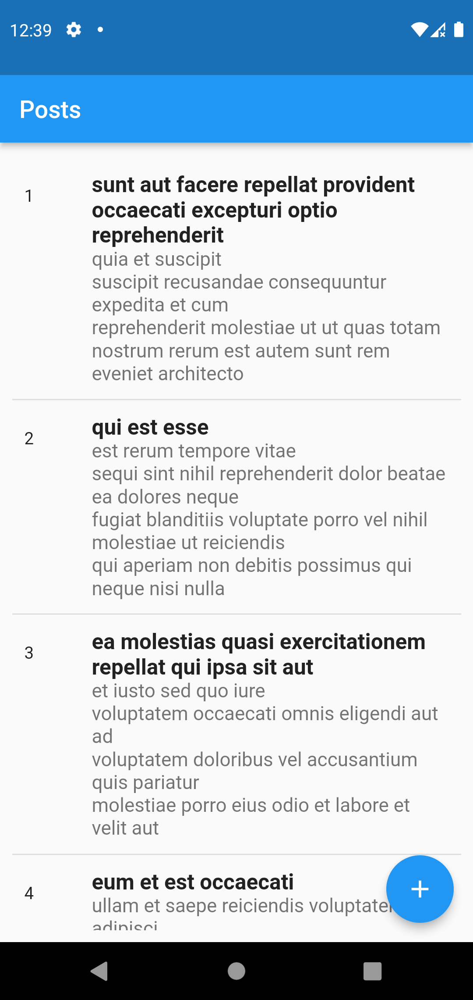
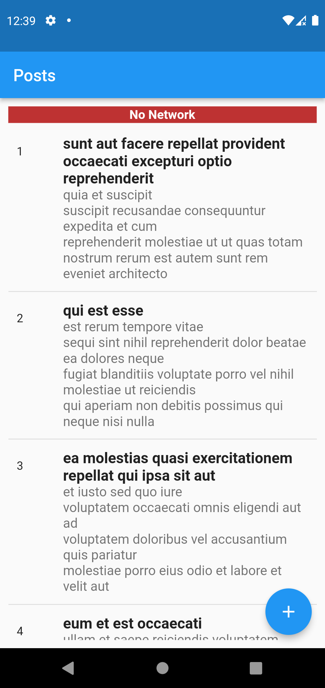
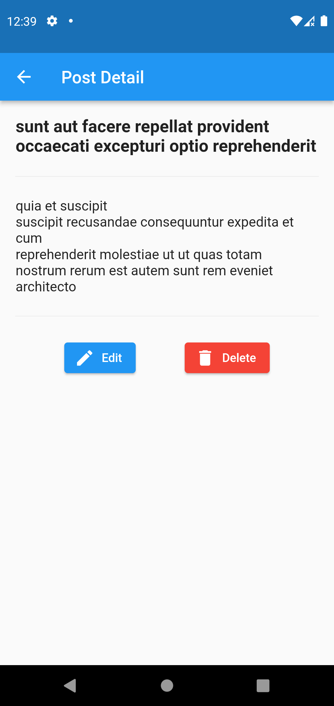

# Flutter Local Database

### This project is an application for local data storage
### Apply to: sqflite, hive and  shared_preferences
### Use state management: Bloc
### Gat data from Api [{JSON} Placeholder](http://jsonplaceholder.typicode.com/)

## 
# Screenshot
  

